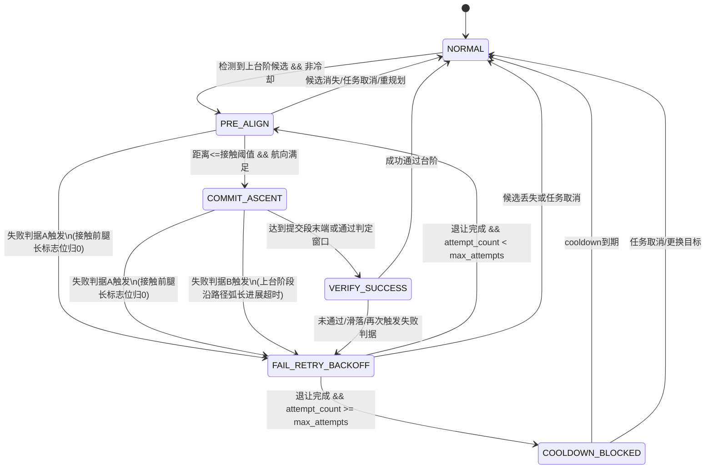

# 台阶能力改造临时计划（第一性原则版）

> 文件用途：先定义问题，再改代码。后续每次实现前后都要回看本文件并逐条确认。
> 当前状态：`Draft v1`（方案讨论中，尚未开始代码改动）

## 1. 问题重述（不带方案预设）

目标不是“加一个上台阶功能”，而是：
1. 在已知地图的前提下，把“跨阶动作”从普通平面导航中解耦出来。
2. 让跨阶过程具备可恢复性（失败可重试、可退让、可熔断），避免卡死在台阶上。
3. 保持主导航循环可维护：职责清晰，planner/controller 不再承担台阶流程编排。

## 2. 已核实现状（来自源码）

1. 台阶地图语义（`stair_layer`）主要在 `LayeredMapManager`：
- 提供 `getStairTraverseNormal()` 和有向约束 `isTransitionAllowed()`。
- 能告诉“这里像台阶区域、法向是什么”，但**没有稳定 stair_id 概念**。

2. 台阶执行逻辑目前在 `nav_server.cpp`（控制主循环内）分散实现：
- `updateStairModeDetection()`：台阶检测与模式切换。
- `doControlling()`：在 `stair_mode==1` 时切到固定速度策略，直接绕过 NMPC 的常规闭环。
- `applyStairModeOmegaLimit()`：对角速度额外限幅。

3. planner 里也有台阶相关逻辑：
- `SimplePlanner` / `PathSmoother` / `BSplineOptimizer` 里有台阶段方向对齐优化。
- 这属于“路径几何优化”，不负责“动作级策略管理”。

4. 当前失败保护不足：
- 跨阶失败基本只会被通用 `controller_timeout` 或 `Recovery` 捕获。
- 没有“针对台阶失败的退让重试策略”。
- 没有“同一台阶失败次数统计与冷却机制”。

## 3. 本质矛盾（第一性原则）

1. 任务层混叠：
- 现在把“地形语义识别 + 跨阶动作决策 + 控制输出覆盖”混在主循环与控制环中。
- 结果是状态不可解释，失败策略不可组合，代码难维护。

2. 失败未建模：
- 跨阶是离散动作过程（接近、对准、提交、通过、失败退出），不能只靠连续控制器超时判断。

3. 缺少对象标识：
- 若要“同一台阶多次失败后冷却”，必须先能识别“同一台阶”。
- 当前接口只有法向/局部允许关系，不足以做稳健统计。

## 4. 改造边界（先立规矩）

1. 最小侵入优先：先解耦结构，再增强策略。
2. 地图层继续负责“语义与约束”，不直接负责“动作状态机”。
3. planner 继续负责“可行路径”，controller 继续负责“常规跟踪”。
4. 新增“特殊地形控制器”负责跨阶流程，并放在主循环中 planner 与 controller 之间。
5. 保留现有 recovery 系统，但允许台阶控制器触发专用恢复触发原因。

## 5. 目标架构（草案，已按本轮讨论收敛）

## 5.1 角色分工

1. `Planner`：给路径（可经过台阶）。
2. `SpecialTerrainController`（新增抽象层，面向未来地形扩展）：
- 建议拆为 `TerrainOrchestrator + TerrainHandler`。
- `TerrainOrchestrator`：统一调度多个地形处理器（台阶/坡/隧道）。
- `TerrainHandler` 统一接口建议：
  - `detect(context) -> score/intent`
  - `enter(context)`
  - `update(context, base_cmd) -> PASS_THROUGH | OVERRIDE_CMD | REQUEST_REPLAN | REQUEST_RECOVERY`
  - `exit(reason)`
  - `applyPlanningConstraint(planner_or_map)`（对规划层施加地形约束）
3. `Controller`：常规跟踪输出（例如 NMPC）。

## 5.2 台阶状态机（收敛版）

1. `NORMAL`：无台阶，完全透传。
2. `PRE_ALIGN`：预对准（仅角度/位置窗口控制，不盲目冲台阶）。
3. `COMMIT_ASCENT`：抬腿 + 固定速度提交段（短时强约束）。
4. `VERIFY_SUCCESS`：判定是否通过。
5. `FAIL_RETRY_BACKOFF`：失败后退让到台阶前安全距离。
6. `COOLDOWN_BLOCKED`：同一台阶超限失败后临时屏蔽。

说明：`SUCCEEDED/FAILED` 作为跨阶动作结果，不替代导航总状态机。

## 5.3 上台阶状态转移图（完整）



状态机约束（本轮已确认）：
1. 失败判据是双通道：
- 判据A：接触阈值之前腿长标志位归0。
- 判据B：台阶上沿路径弧长进展在超时时间内不足阈值。
2. 退让轨迹：
- 沿台阶法向退让，目标点约束到台阶中垂线延长线。
3. 冷却约束：
- 冷却期间仅禁止“上台阶方向”，不禁止下台阶方向。

## 6. 分阶段实施计划（每阶段都可回滚）

## 阶段A：结构解耦（行为尽量不变）

1. 新增 `SpecialTerrainController` 基类（`nav_core`）。
2. 新增 `StairController`（`nav_components`），先把现有 stair_mode 检测、固定速度、omega 限幅迁移进去。
3. `NavServer::doControlling()` 改为统一调用：
- 先跑常规 controller 得到候选 cmd
- 再交给 terrain controller 决定是否覆盖

验收标准：
1. 功能行为与当前版本近似一致。
2. 主循环显著简化。
3. 参数名保持兼容（尽量不破坏现有 YAML）。

## 阶段B：引入台阶动作状态机（不加冷却）

1. 在 `StairController` 内部实现上述 6 态中的前 5 态基础流。
2. 明确每个状态的进入/退出条件（距离、航向误差、最小保持时间、最大持续时间、进展量）。
3. 把“失败判定”从通用超时中分离出“跨阶失败判定”。

验收标准：
1. 失败时不会在台阶边反复抖动输出。
2. 会自动退让到预设距离后再次尝试。

## 阶段C：同台阶重试与冷却

1. 给台阶建立可稳定识别的 `stair_id`（建议来自 mask 连通域或高侧线段聚类）。
2. 对每个 `stair_id` 维护：失败计数、最近失败时间、冷却截止时间。
3. 冷却中的台阶直接施加规划约束：仅禁止该 `stair_id` 的上台阶方向，触发重规划。

验收标准：
1. 同一台阶连续失败达到阈值后进入冷却。
2. 冷却结束后可再次尝试。

## 阶段D：观测与验收工具

1. 新增调试状态发布（例如 `/stair_fsm_state`、`/stair_attempt_debug`）。
2. 关键日志统一节流与结构化，便于赛场排障。
3. 补充参数文档与默认值说明。

## 7. 验证路径（每阶段至少执行）

1. 构建检查：
```bash
colcon build --packages-select nav_core nav_components --symlink-install
```

2. 启动后节点/话题检查：
```bash
ros2 node list | rg nav_server
ros2 topic list | rg "stair|cmd_vel|plan|navigate"
```

3. 台阶状态观测（实现后）：
```bash
ros2 topic echo /stair_mode
# 若新增
ros2 topic echo /stair_fsm_state
```

4. 回归：普通无台阶路径任务不应触发台阶接管。

## 8. 风险点（提前暴露）

1. `stair_id` 生成不稳会直接破坏“同台阶冷却”。
2. 触发条件过敏会导致误进入跨阶态，影响平地导航。
3. 退让策略若不考虑局部障碍，可能退让失败并引发二次卡死。
4. 固定速度提交段若没有严格超时/位移守卫，会放大风险。

## 9. 已确认决策（2026-04-07）

1. 失败判据：
- 双通道失败判据并行启用：
  - A：接触台阶前腿长标志位归0即失败。
  - B：台阶上沿路径弧长进展超时即失败。
2. 接触判定方式：
- 使用距离阈值判定“接触前/接触后”窗口。
3. 进展度量：
- 使用沿路径弧长增量，不使用欧式位移。
4. 退让策略：
- 沿台阶法向退让，目标落在台阶中垂线延长线。
5. 尝试与冷却：
- 最大尝试次数、冷却时长均参数化（YAML 可调）。
6. 冷却对规划影响：
- 冷却期间直接约束 `stair_layer`，规划层不可走上台阶方向。
7. 禁止方向：
- 仅禁止上台阶方向，不禁止下台阶方向。
8. 固定速度策略：
- 维持单一 YAML 参数配置，不做多档。
9. 扩展性要求：
- `SpecialTerrainController` 必须支持未来坡/隧道等地形处理器扩展。
10. 上台成功阈值语义：
- `success_dist_m` 定义为“越过台阶中心线后的法向距离阈值”。
11. 退化搜索带宽：
- `tangent_search_half_width` 默认值同意采用 `0.3m`。
12. 冷却计数作用域：
- 按节点生命周期累计（非单次任务内清零）。
13. 冷却计时基准：
- 采用与现实流逝一致的单调时钟（`steady_clock`）计算冷却到期，不依赖 ROS 仿真时钟跳变。
14. 失败计数清零条件：
- 同一 `stair_id` 成功通过一次后，失败计数清零。
15. 冷却持久化：
- 暂不做跨重启持久化；节点重启后计数清零。
16. 判据A防抖：
- 腿长标志位连续 `N` 个控制周期为失败值才判定失败（`N` 参数化）。
17. 退让失败处理：
- 先执行中垂线局部退化搜索；仍失败再 `REQUEST_RECOVERY`。
18. 冷却触发即时行为：
- 进入 `COOLDOWN_BLOCKED` 后立即 `REQUEST_REPLAN`，退出当前跨阶流程，不继续沿旧路径提交。
19. 多地形仲裁：
- 优先级 `stair > slope`；
- `stair` 与 `tunnel` 不会同时启用（当前系统假设）。
20. 验收通过标准：
- 同一台阶连续失败达到阈值后必进入冷却；
- 冷却后重规划路径不包含该台阶上行边；
- 平地任务不应误触发台阶接管（0 误触发目标）。

## 10. 待联合确认（TODO，非本次讨论阻塞）

1. 嵌入式腿长标志位接口：
- 话题名、消息类型、取值语义、刷新率、失联超时保护策略。
2. 失败判据A与接触阈值的精确时序：
- 标志位采样时刻与控制周期对齐策略（防抖窗口/去抖计数）。

---

确认通过后，我会先执行阶段A（纯结构解耦，尽量不改变行为），并在每一小步提交前后对照本文件逐条确认。
