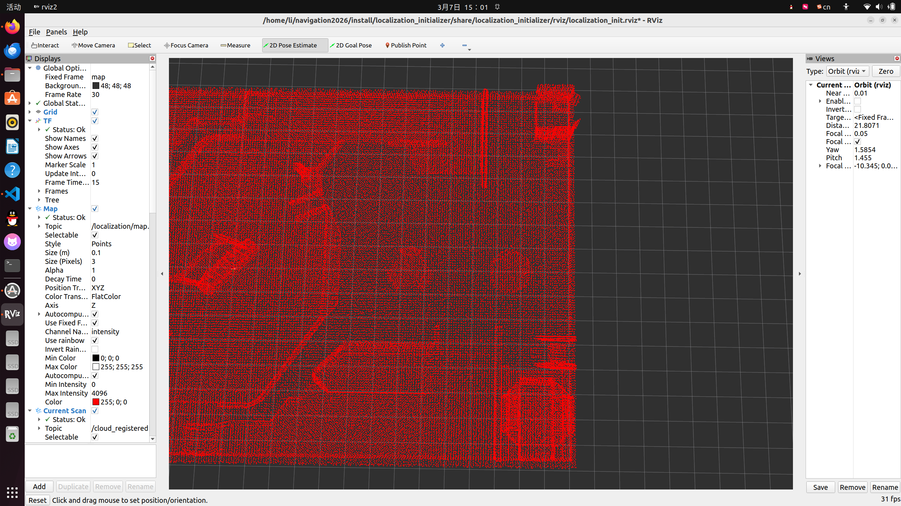
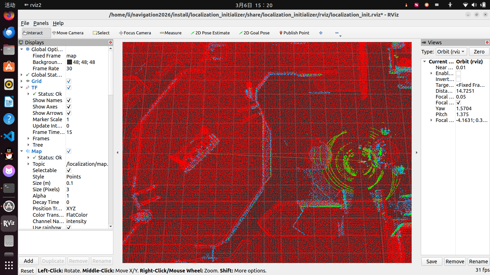

# NDT重定位算法原理与使用

## 1.原理
3Dndt(正态分布变换，Normal-Distributions Transform)
将离散的3D激光点云抽象成三维的正态分布概率密度函数（PDF），然后利用扫到的点云给一个位姿，拿这个位姿去让扫到的点云用一个初始位姿去转到目标点云上，利用牛顿法计算出在偏差最小情况下的位姿。
## 2.优势
- 与icp不同，摒弃了“点对点”的配准，转换为概率密度函数（PDF），可以用数值优化方法来求解位姿，避免了局部最优解。
- 对于动态物体，ndt有天然的优势可以避免动态障碍物对配准的影响：因为对于目标函数，他的得分是全局所有得分求和，动态障碍物对于全局的影响非常的小。
它在正态分布上引入了均匀分布来处理动态障碍物，所以对于噪声很多的环境配准也有很好的效果（前提是参数调好）
### 3.优化方式
1. 迭代网格划分
使用三次ndt,从粗到细，收敛速度不会线性增长，但是精度会得到显著提高
2. 三线性插值
由于ndt是网格配准，有时候一个墙壁会被分割，开启三线性插值后，会同时计算周围8个格子的函数，鲁棒性得到显著提高。
3. 链接网络
当前点云的一个点，刚好落在了一个没有概率云的空白格子，开启之后会让落空的点去寻找离它最近的、有概率云的格子。
### 4.使用方式
1. 先编译该文件
2. 打开一个终端，运行point_lio
```
source install/setup.bash
ros2 launch small_point_lio small_point_lio.launch.py
```
3. 打开另一个终端，运行ndt
```
source install/setup.bash
ros2 launch localization_initializer localization_init.launch.py
```
这个时候会打开rviz,会看到一张先验的地图
使用"2D Pose Estimate"工具，选出机器人在地图里对应的位姿

4. 等待结果

